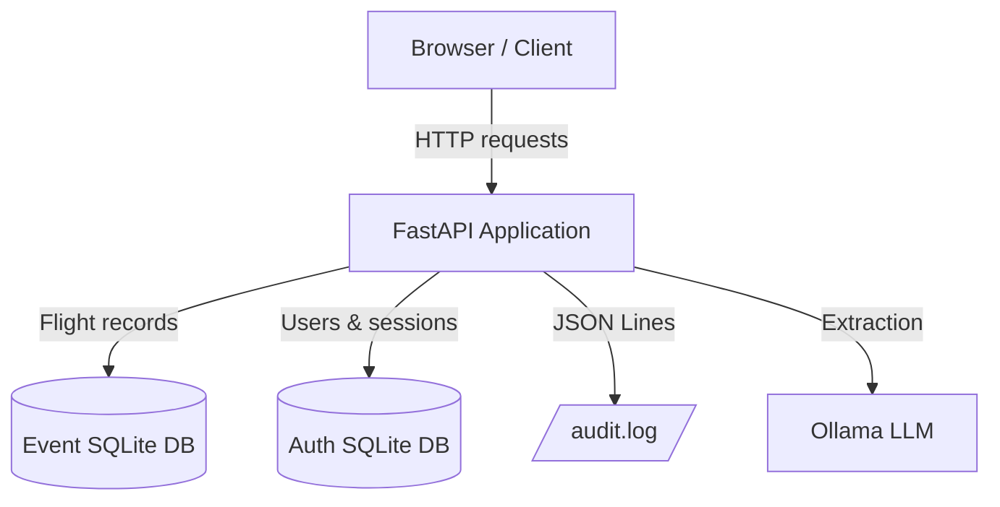
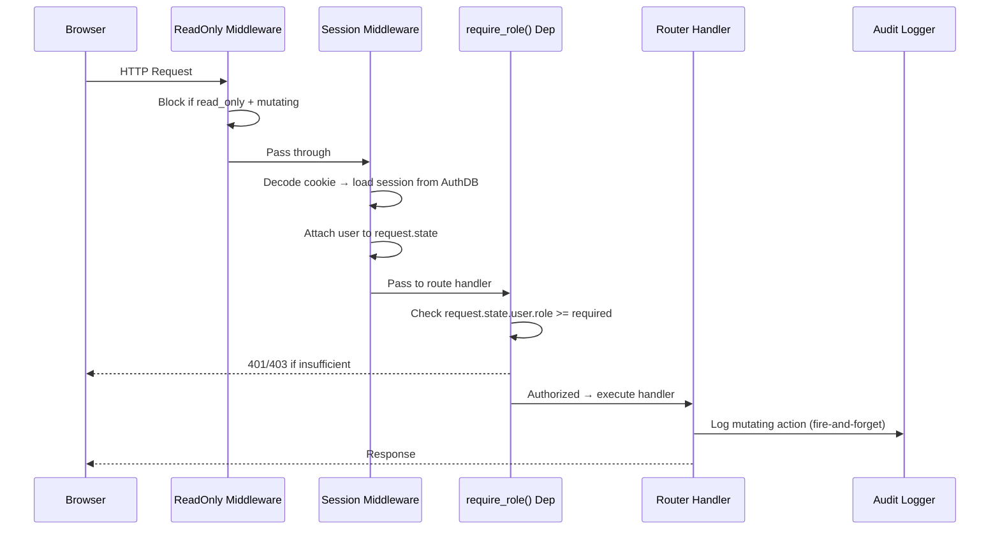

# Design Document: Auth and Audit

## Overview

This design adds session-based authentication, role-based authorization (admin / data_entry / public), and structured audit logging to the Flight Card Scanner application. The implementation integrates with the existing FastAPI + SQLAlchemy async + Jinja2 stack using a second SQLite database for auth data, Starlette middleware for session resolution, FastAPI dependencies for role enforcement, and Python's logging module for audit output.

### Design Goals

- Minimal disruption to existing router/service code
- Clear separation: auth database independent of event database
- Server-side session state (no JWT, no client-side tokens)
- Audit trail that survives application restarts
- Template-level element hiding based on role (server-rendered, not CSS)

### Key Design Decisions

| Decision | Choice | Rationale |
|----------|--------|-----------|
| Auth storage | Separate SQLite DB | Persists across event DB rotations; same async driver already in use |
| Session mechanism | Signed cookie (itsdangerous) + DB-stored session record | Works naturally with server-rendered HTML; no client JS token management |
| Password hashing | Argon2id (argon2-cffi) | OWASP 2026 recommendation; memory-hard, GPU-resistant |
| Role enforcement | FastAPI dependency `require_role()` | Clean, composable, testable; no middleware overhead per-route |
| User context in templates | Middleware resolves session → user; Jinja2 globals injected | Every template gets user info without changing every router |
| Rate limiting storage | In-memory dict with TTL cleanup | Simple, no external deps; resets on restart (acceptable for this app) |
| Audit logging | Python `logging.getLogger("audit")` + FileHandler | JSON Lines format; decoupled from request lifecycle; non-blocking |
| IP binding strategy | Strict for admin (invalidate on IP change), soft for data_entry (log and continue) | Admin sessions are high-value targets; strict binding limits session hijacking. Data entry users may roam (mobile, VPN changes) so soft binding logs the event for review without disrupting workflow. |
| Read-only interaction | Auth checks run AFTER existing read_only middleware | If read_only blocks the request, auth is irrelevant |

## Architecture

### System Context Diagram



### Request Flow



### Middleware and Dependency Ordering

1. **read_only_guard** (existing) — blocks mutating requests in read-only mode
2. **session_middleware** (new) — resolves session cookie → user, attaches to `request.state`
3. **require_role(min_role)** (new) — FastAPI dependency, checks `request.state.user`

This ordering means:
- Read-only mode short-circuits before auth is checked (no unnecessary DB lookups)
- Session resolution happens once per request (middleware), not per-dependency
- Role checking is explicit per-route via dependencies (not blanket middleware)

## Components and Interfaces

### 1. Auth Database Module (`flight_card_scanner/auth_database.py`)

Mirrors the pattern in `database.py` but for the auth database.

```python
# Separate engine and session factory for the auth database
_auth_engine: AsyncEngine | None = None
_auth_session: async_sessionmaker[AsyncSession] | None = None

def init_auth_engine(db_path: Path) -> AsyncEngine:
    """Create auth database engine. Called once at startup."""
    ...

async def get_auth_db() -> AsyncGenerator[AsyncSession, None]:
    """FastAPI dependency yielding an auth database session."""
    ...

async def create_auth_tables(engine: AsyncEngine) -> None:
    """Create User and Session tables if they don't exist."""
    ...
```

### 2. Auth Models (`flight_card_scanner/auth_models.py`)

```python
class User(AuthBase):
    __tablename__ = "users"

    id: Mapped[int]  # primary key, autoincrement
    email: Mapped[str]  # unique, max 254, stored lowercase
    display_name: Mapped[str]  # max 100
    password_hash: Mapped[str]  # Argon2id hash
    role: Mapped[str]  # "admin" | "data_entry"
    active: Mapped[bool]  # default True
    created_at: Mapped[datetime]  # server_default=func.now()

class Session(AuthBase):
    __tablename__ = "sessions"

    id: Mapped[str]  # token_urlsafe(32), primary key
    user_id: Mapped[int]  # FK → users.id
    created_at: Mapped[datetime]
    last_active: Mapped[datetime]  # updated on each authenticated request
    is_valid: Mapped[bool]  # default True; set False on logout/deactivation
    client_ip: Mapped[str | None]  # IP address at session creation
```

### 3. Auth Service (`flight_card_scanner/services/auth_service.py`)

Pure business logic — no HTTP concerns.

```python
class AuthService:
    def __init__(self, session_factory, session_secret: str,
                 timeout_hours: float):
        ...

    async def create_user(self, email: str, display_name: str,
                          password: str, role: str) -> User:
        """Hash password, normalize email, insert user."""
        ...

    async def authenticate(self, email: str, password: str) -> User | None:
        """Verify credentials. Returns User or None.
        Always runs argon2 verify (even for non-existent emails)
        to prevent timing attacks."""
        ...

    async def create_session(self, user_id: int, client_ip: str | None = None) -> str:
        """Generate session token, store in DB with client_ip, return token."""
        ...

    async def validate_session(self, token: str, client_ip: str | None = None) -> User | None:
        """Look up session, check idle expiry, check hard max lifetime
        (8h admin / 120h data_entry based on created_at), enforce IP binding:
        - admin: if client_ip differs from stored → invalidate, return None
        - data_entry: if client_ip differs → call audit logger with
          "ip_changed" event, continue with session valid.
        Update last_active. Returns User or None."""
        ...

    async def invalidate_session(self, token: str) -> None:
        """Mark session as invalid."""
        ...

    async def invalidate_user_sessions(self, user_id: int) -> None:
        """Invalidate all sessions for a user (on deactivation)."""
        ...

    def check_rate_limit(self, email: str) -> tuple[bool, int]:
        """Check if email is rate-limited.
        Returns (is_limited, seconds_remaining)."""
        ...

    def record_failed_attempt(self, email: str) -> None:
        """Record a failed login attempt for rate limiting."""
        ...

    def reset_failed_attempts(self, email: str) -> None:
        """Clear failed attempts on successful login."""
        ...
```

#### Rate Limiting Implementation

```python
# In-memory storage (resets on restart — acceptable for this use case)
_failed_attempts: dict[str, list[float]] = {}
# Key: lowercase email
# Value: list of timestamps of failed attempts within the sliding window

RATE_LIMIT_MAX_ATTEMPTS = 5
RATE_LIMIT_WINDOW_SECONDS = 15 * 60  # 15 minutes

def check_rate_limit(self, email: str) -> tuple[bool, int]:
    key = email.lower()
    now = time.time()
    attempts = self._failed_attempts.get(key, [])
    # Prune attempts outside the window
    attempts = [t for t in attempts if now - t < RATE_LIMIT_WINDOW_SECONDS]
    self._failed_attempts[key] = attempts
    if len(attempts) >= RATE_LIMIT_MAX_ATTEMPTS:
        # Seconds until the oldest attempt expires
        oldest = min(attempts)
        remaining = int(RATE_LIMIT_WINDOW_SECONDS - (now - oldest)) + 1
        return (True, remaining)
    return (False, 0)
```

### 4. Session Middleware (`flight_card_scanner/middleware/session_middleware.py`)

```python
class SessionMiddleware:
    """ASGI middleware that resolves the session cookie and attaches user to request.state."""

    def __init__(self, app: ASGIApp, auth_service: AuthService,
                 cookie_name: str = "fcs_session",
                 session_secret: str = ""):
        ...

    async def __call__(self, scope, receive, send):
        if scope["type"] != "http":
            await self.app(scope, receive, send)
            return

        request = Request(scope)
        # Decode signed cookie
        token = self._get_session_token(request)
        user = None
        if token:
            client_ip = request.client.host if request.client else None
            user = await self.auth_service.validate_session(token, client_ip=client_ip)
            if user is None:
                # Session invalid/expired/IP-rejected — schedule cookie clearing
                scope["state"]["clear_session_cookie"] = True

        # Attach user (or None) to request.state
        scope.setdefault("state", {})
        scope["state"]["user"] = user
        scope["state"]["session_token"] = token

        await self.app(scope, receive, send)
```

### 5. Role Dependency (`flight_card_scanner/dependencies/auth.py`)

```python
from enum import IntEnum

class Role(IntEnum):
    PUBLIC = 0
    DATA_ENTRY = 1
    ADMIN = 2

ROLE_MAP = {"admin": Role.ADMIN, "data_entry": Role.DATA_ENTRY}

def require_role(min_role: Role):
    """FastAPI dependency factory for role-based access control.

    Usage:
        @router.post("/api/admin/mode")
        async def set_mode(..., _=Depends(require_role(Role.DATA_ENTRY))):
            ...
    """
    async def dependency(request: Request):
        user = getattr(request.state, "user", None)
        if user is None:
            # Determine if this is an API or HTML request
            if _is_api_request(request):
                raise HTTPException(status_code=401,
                    detail="Authentication required")
            else:
                next_url = str(request.url.path)
                raise HTTPException(
                    status_code=302,
                    headers={"Location": f"/login?next={next_url}"})
        user_role = ROLE_MAP.get(user.role, Role.PUBLIC)
        if user_role < min_role:
            if _is_api_request(request):
                raise HTTPException(status_code=403,
                    detail="Insufficient permissions")
            else:
                raise HTTPException(status_code=403,
                    detail="Insufficient permissions")
        return user
    return dependency

def _is_api_request(request: Request) -> bool:
    """Heuristic: /api/ prefix or Accept: application/json."""
    return (request.url.path.startswith("/api/") or
            "application/json" in request.headers.get("accept", ""))
```

### 6. Audit Logger (`flight_card_scanner/services/audit_service.py`)

```python
import json
import logging
from datetime import datetime, timezone

_audit_logger: logging.Logger | None = None

def init_audit_logger(log_path: Path) -> None:
    """Configure the 'audit' logger with a dedicated FileHandler.

    - Logger name: "audit"
    - Handler: FileHandler (append mode)
    - Formatter: raw message only (we format the JSON ourselves)
    - Propagate: False (don't emit to root logger)
    """
    logger = logging.getLogger("audit")
    logger.setLevel(logging.INFO)
    logger.propagate = False
    handler = logging.FileHandler(str(log_path), mode="a")
    handler.setFormatter(logging.Formatter("%(message)s"))
    logger.addHandler(handler)
    global _audit_logger
    _audit_logger = logger

def log_action(
    actor: str,           # user email or "anonymous"
    action: str,          # "created" | "updated" | "deleted" | "extracted" |
                          # "requeued" | "login" | "logout" | "login_failed" |
                          # "ip_changed"
    object_type: str,     # "flight_record" | "user" | "session"
    object_id: int | str,
    details: dict | None = None,
) -> None:
    """Write a single audit entry as a JSON line.

    Non-blocking: catches all exceptions and logs to app logger on failure.
    """
    entry = {
        "timestamp": datetime.now(timezone.utc).isoformat(),
        "actor": actor,
        "action": action,
        "object_type": object_type,
        "object_id": object_id,
        "details": details or {},
    }
    try:
        if _audit_logger:
            _audit_logger.info(json.dumps(entry, default=str))
    except Exception as exc:
        logging.getLogger(__name__).error(
            "Failed to write audit entry: %s", exc
        )
```

### 7. Auth Router (`flight_card_scanner/routers/auth.py`)

New router handling login/logout UI and user management API.

```python
router = APIRouter()

# --- Login/Logout (public access) ---

@router.get("/login", response_class=HTMLResponse)
async def login_page(request: Request, next: str | None = None):
    """Render the login form."""
    ...

@router.post("/login")
async def login_submit(request: Request, email: str = Form(...),
                       password: str = Form(...), next: str | None = Form(None)):
    """Authenticate user, create session, set cookie, redirect."""
    # 1. Check rate limit
    # 2. Authenticate (always runs argon2 verify)
    # 3. On success: create session (with request.client.host), set signed cookie, audit log, redirect
    # 4. On failure: record attempt, audit log, render form with error
    ...

@router.get("/logout")
async def logout(request: Request):
    """Invalidate session, clear cookie, redirect to /login."""
    ...

# --- User Management (admin only) ---

@router.get("/admin/users", response_class=HTMLResponse,
            dependencies=[Depends(require_role(Role.ADMIN))])
async def users_page(request: Request):
    """Render the user management page."""
    ...

@router.get("/api/admin/users",
            dependencies=[Depends(require_role(Role.ADMIN))])
async def list_users():
    """Return all users as JSON."""
    ...

@router.post("/api/admin/users",
             dependencies=[Depends(require_role(Role.ADMIN))])
async def create_user(body: CreateUserRequest):
    """Create a new user account."""
    ...

@router.put("/api/admin/users/{user_id}",
            dependencies=[Depends(require_role(Role.ADMIN))])
async def update_user(user_id: int, body: UpdateUserRequest):
    """Update user fields (display_name, role, active, password)."""
    ...
```

### 8. Template Context Injection

The session middleware attaches the user to `request.state`. Template globals are extended:

```python
# In lifespan, after creating templates:
templates.env.globals["read_only"] = config.read_only
# The user context is per-request, so we inject via a helper in each router
# OR use a Jinja2 context processor pattern:

# In each TemplateResponse call, the context includes:
context = {
    ...existing context...,
    "current_user": getattr(request.state, "user", None),
}
```

**Template usage (in base.html):**
```html

  <span>{{ current_user.display_name }}</span>
  <a href="/logout">Logout</a>

  <a href="/login">Login</a>

```

**Conditional element rendering:**
```html

  <button class="delete-btn">Delete Record</button>



  <button class="edit-btn">Edit</button>

```

### 9. Integration with Existing Read-Only Middleware

The existing `read_only_guard` middleware in `main.py` blocks all non-GET/HEAD/OPTIONS requests when `config.read_only` is True. This remains unchanged and executes **before** the session middleware:

```python
# Order in main.py:
app.add_middleware(SessionMiddleware, ...)  # Added second (runs second)
# read_only_guard is already @app.middleware("http") — runs first

# The read_only_guard returns 403 before session resolution occurs.
# This is correct: if the app is read-only, auth status doesn't matter for writes.
```

Template rendering also respects read_only independently:
- `read_only=True` → all mutating UI elements hidden regardless of role
- `read_only=False` → UI elements shown based on role

## Data Models

### Auth Database Schema

```sql
CREATE TABLE users (
    id INTEGER PRIMARY KEY AUTOINCREMENT,
    email TEXT NOT NULL UNIQUE,          -- stored lowercase, max 254 chars
    display_name TEXT NOT NULL,          -- max 100 chars
    password_hash TEXT NOT NULL,         -- Argon2id hash string
    role TEXT NOT NULL DEFAULT 'data_entry',  -- 'admin' | 'data_entry'
    active INTEGER NOT NULL DEFAULT 1,  -- boolean
    created_at TEXT NOT NULL DEFAULT (datetime('now'))
);

CREATE TABLE sessions (
    id TEXT PRIMARY KEY,                 -- secrets.token_urlsafe(32)
    user_id INTEGER NOT NULL REFERENCES users(id),
    created_at TEXT NOT NULL DEFAULT (datetime('now')),
    last_active TEXT NOT NULL,           -- updated on each request
    is_valid INTEGER NOT NULL DEFAULT 1, -- boolean
    client_ip TEXT                       -- IP address at session creation
);

CREATE INDEX ix_sessions_user_id ON sessions(user_id);
CREATE INDEX ix_sessions_last_active ON sessions(last_active);
```

### Configuration Schema Extension

New keys in `config.json`:

```json
{
  "auth_db_path": "./auth.db",
  "session_timeout_hours": 8,
  "audit_log_path": null
}
```

- `auth_db_path`: Path to auth SQLite DB. Default `"./auth.db"` resolved relative to config file directory.
- `session_timeout_hours`: Idle timeout for sessions (time since last activity). Default 8. Range [0.25, 8]. Does not affect the role-specific Hard_Max_Lifetime, which is fixed at 8 hours for admin and 120 hours for data_entry.
- `audit_log_path`: Path to audit log file. Default `"{event_data_path}/audit.log"`.

New environment variables:
- `FCS_SESSION_SECRET`: Required. Signing key for session cookies. Minimum 16 characters.
- `FCS_ADMIN_EMAIL`: Optional. Email for auto-created admin on first run.
- `FCS_ADMIN_PASSWORD`: Optional. Password for auto-created admin on first run.

### Audit Log Entry Schema

Each line is a JSON object:

```json
{
  "timestamp": "2026-04-24T14:30:00.123456+00:00",
  "actor": "admin@example.com",
  "action": "updated",
  "object_type": "flight_record",
  "object_id": 42,
  "details": {
    "changes": {
      "flier_name": {"old": "Jon Smith", "new": "John Smith"},
      "human_verified": {"old": false, "new": true}
    }
  }
}
```

Action verbs: `"created"`, `"updated"`, `"deleted"`, `"extracted"`, `"requeued"`, `"login"`, `"logout"`, `"login_failed"`, `"ip_changed"`

Object types: `"flight_record"`, `"user"`, `"session"`

### Pydantic Schemas (New)

```python
class CreateUserRequest(BaseModel):
    email: str = Field(max_length=254)
    display_name: str = Field(max_length=100)
    password: str = Field(min_length=8, max_length=128)
    role: Literal["admin", "data_entry"]

class UpdateUserRequest(BaseModel):
    display_name: str | None = Field(None, max_length=100)
    role: Literal["admin", "data_entry"] | None = None
    active: bool | None = None
    password: str | None = Field(None, min_length=8, max_length=128)

class UserResponse(BaseModel):
    id: int
    email: str
    display_name: str
    role: str
    active: bool
    created_at: datetime
```

### AppConfig Extension

```python
@dataclass
class AppConfig:
    # ... existing fields ...
    auth_db_path: Path = field(
        default_factory=lambda: Path("./auth.db")
    )
    session_timeout_hours: float = 8.0
    audit_log_path: Path | None = None  # defaults to {event_data_path}/audit.log

    @property
    def effective_audit_log_path(self) -> Path:
        if self.audit_log_path:
            return self.audit_log_path
        return self.event_data_path / "audit.log"
```

## Correctness Properties

*A property is a characteristic or behavior that should hold true across all valid executions of a system — essentially, a formal statement about what the system should do. Properties serve as the bridge between human-readable specifications and machine-verifiable correctness guarantees.*

### Property 1: Password Hashing Round-Trip

*For any* valid password string (8-128 characters), hashing with Argon2id and then verifying the original password against the hash SHALL succeed, and verifying any different password against that hash SHALL fail.

**Validates: Requirements 1.3, 8.1**

### Property 2: Case-Insensitive Email Identity

*For any* email string, the system SHALL treat that email and any case-variant of it (uppercase, lowercase, mixed) as the same identity for uniqueness constraints and login matching.

**Validates: Requirements 1.4**

### Property 3: Session Lifecycle Validity

*For any* authenticated user with an active session, the session SHALL be valid for requests made within the idle timeout period AND within the role-specific Hard_Max_Lifetime. After the idle timeout elapses without activity, OR after the Hard_Max_Lifetime is exceeded regardless of activity, the session SHALL be treated as expired and the user as unauthenticated.

**Validates: Requirements 2.2, 2.7, 2.8, 2.9, 2.12, 2.13**

### Property 4: Role Hierarchy Access Control

*For any* endpoint with a minimum required role R, and any user with role U, the request SHALL be permitted if and only if U >= R in the hierarchy (admin > data_entry > public). An unauthenticated request SHALL be treated as role "public".

**Validates: Requirements 3.1, 3.2, 3.3, 3.4, 3.5, 3.6, 3.7, 3.8, 3.9**

### Property 5: User CRUD Correctness

*For any* valid user creation request (email ≤ 254 chars, display_name ≤ 100 chars, password 8-128 chars, role in {"admin", "data_entry"}), creating the user and then retrieving it SHALL return the same email (lowercased), display_name, and role, with a non-plaintext password_hash and active=True.

**Validates: Requirements 5.2, 5.3**

### Property 6: Session Invalidation on Deactivation

*For any* user with N active sessions (N ≥ 1), deactivating that user SHALL invalidate all N sessions such that subsequent requests using any of those session tokens are treated as unauthenticated.

**Validates: Requirements 5.5**

### Property 7: Audit Log Integrity

*For any* mutating action (record create/update/delete, extraction, requeue, login, logout, login_failed), the audit log SHALL contain exactly one new JSON line that is independently parseable, contains a valid ISO 8601 timestamp, the correct actor identifier, the correct action verb, the correct object type and ID, and SHALL never contain any plaintext password value.

**Validates: Requirements 6.3, 6.4, 6.5, 6.6, 8.6**

### Property 8: Rate Limiting Enforcement

*For any* email address, after exactly 5 failed login attempts within a 15-minute sliding window, the next login attempt for that email SHALL be rejected with HTTP 429 regardless of whether the credentials are valid. After a successful login (when under the limit), the failed-attempt counter SHALL reset to zero.

**Validates: Requirements 8.2, 8.3, 8.7**

### Property 9: No User Enumeration

*For any* login attempt with invalid credentials, the HTTP response body SHALL be identical regardless of whether the email exists in the system or not, and the response time SHALL not differ by more than 100ms between existing and non-existing accounts.

**Validates: Requirements 2.3, 8.5**

### Property 10: Configuration Validation

*For any* value of `FCS_SESSION_SECRET` that is empty, whitespace-only, or fewer than 16 characters, the application SHALL refuse to start. *For any* `session_timeout_hours` value that is not a number or is outside the range [0.25, 8], the application SHALL refuse to start.

**Validates: Requirements 7.3, 7.4**

### Property 11: Admin Strict IP Binding

*For any* admin session created with a recorded client IP, when a subsequent request arrives from a different IP address, the session SHALL be immediately invalidated and the request treated as unauthenticated.

**Validates: Requirements 8.8**

### Property 12: Data Entry Soft IP Binding

*For any* data_entry session created with a recorded client IP, when a subsequent request arrives from a different IP address, the session SHALL remain valid (request proceeds normally) AND the audit log SHALL contain an "ip_changed" event with the session ID, old IP, and new IP.

**Validates: Requirements 8.9, 6.6**

### Property 13: Hard Max Lifetime Enforcement

*For any* session, regardless of activity, the session SHALL be invalid once the elapsed time since `created_at` exceeds the role-specific Hard_Max_Lifetime (8 hours for admin, 120 hours for data_entry). Active use (updating `last_active`) SHALL NOT extend the session beyond this hard limit.

**Validates: Requirements 2.12, 2.13, 8.10**

## Error Handling

### Authentication Errors

| Scenario | HTML Response | API Response |
|----------|---------------|--------------|
| No session (protected page) | 302 → /login?next=... | 401 JSON |
| No session (protected API) | — | 401 JSON |
| Expired session | Clear cookie, treat as no session | Clear cookie, 401 JSON |
| Insufficient role (page) | 403 error page | — |
| Insufficient role (API) | — | 403 JSON |
| Rate limited | 429 with retry info on login page | 429 JSON with `retry_after` |
| Invalid login | Re-render login with generic error | — |

### Audit Logger Errors

- If the audit log file cannot be written (permissions, disk full): log error to app logger, do NOT raise, do NOT block the request.
- The audit logger is fire-and-forget from the request handler's perspective.

### Configuration Errors at Startup

- Missing `FCS_SESSION_SECRET`: log error and `sys.exit(1)`
- Secret < 16 chars: log error and `sys.exit(1)`
- Invalid `session_timeout_hours`: log error with accepted range and `sys.exit(1)`
- Auth DB path not writable: log error and `sys.exit(1)` (unless `read_only=True`)

### Database Errors

- Auth DB connection failures: caught at session validation; user treated as unauthenticated (graceful degradation)
- User creation conflicts (duplicate email): return 409 with descriptive error

## Testing Strategy

### Property-Based Tests (Hypothesis)

The feature is suitable for property-based testing — the auth service contains pure functions (password hashing, email normalization, rate limit logic) and stateful operations with universal properties (session lifecycle, role hierarchy).

**Library:** `hypothesis` (already in use in this project, as evidenced by `.hypothesis/` directory)

**Configuration:** Minimum 100 examples per test.

Each property test is tagged:
```python
# Feature: auth-and-audit, Property 1: Password hashing round-trip
```

**Property tests to implement:**

1. Password hashing round-trip (Property 1)
2. Case-insensitive email identity (Property 2)
3. Role hierarchy access control (Property 4) — generate (role, endpoint, expected_result) triples
4. Rate limiting enforcement (Property 8) — generate sequences of attempts
5. Configuration validation (Property 10) — generate invalid secrets/timeouts
6. Audit log integrity (Property 7) — generate random actions, verify JSON Lines output
7. User CRUD correctness (Property 5) — generate valid user data, verify round-trip
8. Admin strict IP binding (Property 11) — generate sessions with varying IPs, verify invalidation
9. Data entry soft IP binding (Property 12) — generate sessions with IP changes, verify session survives and audit entry written
10. Hard max lifetime enforcement (Property 13) — generate sessions at various ages per role, verify expiry at boundary

### Unit Tests (pytest)

- Session lifecycle (create, validate, expire, invalidate) — Property 3
- Session invalidation on deactivation — Property 6
- No user enumeration (timing + response body) — Property 9
- Admin session invalidation on IP change — Property 11
- Data entry session continues on IP change with audit log — Property 12
- Hard max lifetime expiry (admin at 8h, data_entry at 120h) — Property 13
- Login/logout happy paths
- Self-demotion prevention (Req 5.4)
- Duplicate email rejection (Req 5.7)
- Template context injection (Req 4.1)
- Cookie attributes (HttpOnly, SameSite, Secure) — Req 2.6
- Default admin creation at startup — Req 1.6/1.7

### Integration Tests

- Full login → access protected page → logout flow
- Rate limiting through actual HTTP requests
- Audit log file written correctly across multiple actions
- Read-only mode interaction with auth
- Middleware ordering (read_only runs before auth)

### Test File Structure

```
tests/
├── test_auth_service.py        # Property + unit tests for AuthService
├── test_auth_models.py         # Schema/model tests
├── test_auth_middleware.py     # Session middleware tests
├── test_auth_router.py         # Login/logout/user-mgmt endpoint tests
├── test_audit_service.py       # Audit logger property + unit tests
├── test_role_dependency.py     # require_role() tests
└── test_auth_integration.py    # End-to-end auth flow tests
```
